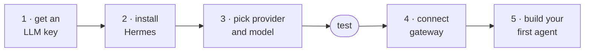

# Building Practical Agents with Hermes Workshop

Build an agent that does something useful for you and live where you work. From 0 -> 1. This workshop is for you if you've never built an agent or if you've built dozens and want to learn how Hermes makes it easier than ever.

## Static Workshop Site

The MVP public site is built with VitePress from Markdown in [`docs/`](docs/).
Target domain: `hermes.arcadian.cloud`.

Run it locally:

```bash
npm install
npm run docs:dev
```

Build and preview the static output:

```bash
npm run docs:build
npm run docs:preview
```

GitHub Pages deployment is defined in [`.github/workflows/pages.yml`](.github/workflows/pages.yml).
The custom domain is recorded in [`docs/public/CNAME`](docs/public/CNAME);
DNS still needs to point `hermes.arcadian.cloud` at GitHub Pages when the repo is
ready to publish.

## What we'll cover

### Part 1) Art of the Possible
- **What's an agent** - not a chatbot. Memory, tools, skills, and a schedule
- **Real use cases** - daily intelligence briefing, business KPI report, homelab health, incident triage, Chat over your data
- **Why Hermes** - works where you already work, self-improving skills, multi-platform, ease of setup
- **Use-case brainstorm** - figure out what *you* want to build before touching install

### Part 2) Setup Your Agent
- **Install and setup** - Hermes on your machine, provider connected
- **Connect where you work** - gateway to Discord, Telegram, Slack, or Teams

### Part 3) Make Your Agent Maximally Useful for You
- **Build your agent** - pick a use case, bootstrap a skill, run your first report
- **Feedback loop** - teach your skill to get sharper with every run
- **Scheudle and delivery** - Run your agent on a schedule, have it message you where you already work

## What you'll leave with

- Your own AI Agent installed and working
- Connected to your messaging platform
- One agent skill bootstrapped for something you actually care about
- The pattern to build more

## The mental model

> **Memory** helps Hermes know *you*. **Skills** help Hermes know *how*.
> **Cron** and **webhooks** tell Hermes *when* to act. **Gateway** puts the
> result *where humans already are*.

## Workshop paths

| Path | What it does | Best if you |
|---|---|---|
| **[Daily Intelligence](examples/prompts/daily-intelligence-agent.md)** | Morning reports over your sources, ranked by what matters to you | Want a working agent fastest |
| **[Homelab Health](examples/prompts/homelab-health.md)** | Read-only triage of disk, services, logs, containers | Run servers at home |
| **[Incident Triage](examples/prompts/alert-triage.md)** | Turns monitoring webhooks into human triage summaries | Are on-call |
| **[ChatOps Over Your Data](examples/prompts/chatops-data.md)** | Plain-language questions over CSVs, SQLite, logs | Query data by hand regularly |

---

# Workshop Guide: Build Your First Daily Intelligence Agent

This is the setup path for the workshop. For full Hermes documentation, use the
official docs: <https://hermes-agent.nousresearch.com/docs>

## Success criteria

Core workshop target:

- [ ] Hermes installed
- [ ] One model/provider connected
- [ ] Local CLI test works
- [ ] Gateway connected - Hermes can reach you on Discord, Telegram, Slack, or Teams
- [ ] One Daily Intelligence Report skill bootstrapped for something you actually care about

Cron and richer data sources are stretch goals.

The whole path, in order:



## 1) LLM Inference - Get Your API Key Ready

Start by making sure you have one working LLM path ready to power your agent.
Do this before the workshop if you can; provider login is the part most likely
to be slowed down by conference wifi.

### Easiest path if you do not already have a subscription: OpenRouter

OpenRouter usually has free model endpoints available:
<https://openrouter.ai/collections/free-models>.

As of *June 2026*, DeepSeek V4 Pro and NVIDIA Nemotron 3 Ultra (free) are good
OpenRouter models to try for this workshop.

**Free as in beer, not free as in private.** OpenRouter's free tier is enough
for initial setup, but free requests may be used for provider training/evals.
OpenRouter currently advertises limited free usage, and a single complex agent
task can burn 5-20+ model requests. If you like the workflow, putting a small
amount of credit on OpenRouter is the simplest hosted path.

### Subscriptions You May Already Have that Work With Hermes

Run `hermes model` and pick the provider you already have. Current Hermes docs
list these common subscription/OAuth-friendly paths:

- **ChatGPT ($20 and up plans):** choose OpenAI Codex. Uses
  ChatGPT/Codex OAuth. Good workshop path if your account has Codex.
- **GitHub Copilot paid plans:** choose GitHub Copilot. Uses OAuth/device-code
  flow, `COPILOT_GITHUB_TOKEN`, `GH_TOKEN`, or `gh auth token`.
- **Claude Max plans ($100 and up plans):** choose Anthropic.
- **Google/Gemini accounts:** choose Google Gemini OAuth. Browser PKCE login;
  docs note free-tier support. Gemini API keys also work.
- **Grok paid plans:** choose xAI Grok OAuth.
- **Qwen accounts:** choose Qwen OAuth. Browser PKCE login.
- **MiniMax accounts:** choose MiniMax OAuth. Browser PKCE login.
- **Nous Portal subscriptions:** choose Nous Portal, or run
  `hermes setup --portal` for one-shot OAuth setup.

If none of those applies, use OpenRouter for the session. Do not spend workshop
time fighting a local model or an enterprise cloud account unless it was already
prepared and tested.

### Local Open Weights models (not recommended during the session)

Local models are not recommended for this session. Links below provided for your
use later.

At time of writing, [Qwen 3.6](https://unsloth.ai/docs/models/qwen3.6) and
[Gemma 4 12B](https://unsloth.ai/docs/models/gemma-4) are the reasonable choices
for local models for running an agent that fit on common consumer hardware.

## 2) Install Hermes

Follow the Official Hermes install guide:
<https://hermes-agent.nousresearch.com/docs/getting-started/installation>

Default command-line install path for Linux, macOS, and WSL2:

```bash
curl -fsSL https://hermes-agent.nousresearch.com/install.sh | bash
```

### Setup Guide
1) Choose **full setup**, the Nous Portal quick setup will require a credit card
2) Model provider: **OpenRouter** if you don't have another subscription
3) Model: `openrouter/deepseek-v4-pro`
4) Terminal backend: local
5) Platform: set up gateway now - we'll do this together in the session
6) Tools: use the default set
7) Browser provider: local

### Optional: Safer Terminal Backends

For the workshop, choosing the **local** terminal backend is fine. It is the
simplest path and keeps setup friction low. Just understand the tradeoff: local
means Hermes runs shell commands on the same machine and user account where you
started it. Treat it like giving a careful junior sysadmin a terminal: use
read-only first, avoid secrets in prompts, and do not run it as root.

If you want more isolation after the workshop, Hermes can run terminal commands
through other backends:

- **Docker backend:** commands run inside a container instead of directly on your
  host. This is a good next step for experimenting safely. Docker docs:
  <https://hermes-agent.nousresearch.com/docs/user-guide/docker>
- **SSH backend:** commands run on a separate machine or VM that you control.
  This is useful for homelab or production-health agents because you can keep
  Hermes away from your personal laptop. It also gives the agent a safe place to
  be root: on a disposable VM or tightly scoped server, you can let it install
  packages, restart services, inspect logs, and run commands more freely without
  giving it root on your daily machine.

SSH backend environment variables are documented here:
<https://hermes-agent.nousresearch.com/docs/reference/environment-variables#ssh-backend>

Minimal SSH setup:

```bash
# 1) Generate a dedicated key for Hermes
ssh-keygen -t ed25519 -f ~/.ssh/hermes_backend_key -C "hermes-backend"

# 2) Install the public key on the remote host
ssh-copy-id -i ~/.ssh/hermes_backend_key.pub hermes@your-server

# 3) Put these in ~/.hermes/.env
TERMINAL_ENV=ssh
TERMINAL_SSH_HOST=your-server
TERMINAL_SSH_USER=hermes
TERMINAL_SSH_KEY=~/.ssh/hermes_backend_key
```

Where to place the SSH key:

- **macOS/Linux:** `~/.ssh/hermes_backend_key`, then lock it down with
  `chmod 600 ~/.ssh/hermes_backend_key`.
- **Windows using WSL2:** put the key inside the WSL home directory, for example
  `/home/<your-wsl-user>/.ssh/hermes_backend_key`, not only in your Windows home
  folder. Then run `chmod 600 ~/.ssh/hermes_backend_key` inside WSL.
- **Windows native/Git Bash:** put the key at
  `C:\Users\<your-windows-user>\.ssh\hermes_backend_key`. If SSH refuses to use
  it because permissions are too open, run this from PowerShell:

```powershell
icacls "$env:USERPROFILE\.ssh\hermes_backend_key" /inheritance:r
icacls "$env:USERPROFILE\.ssh\hermes_backend_key" /grant:r "$($env:USERNAME):R"
```

For safety, start with a non-root remote `hermes` user and grant only the access
it needs. If you later want root, make that an intentional choice on a disposable
VM or clearly bounded host. Test the connection manually before switching Hermes
over:

```bash
ssh -i ~/.ssh/hermes_backend_key hermes@your-server 'whoami && hostname'
```

Reload your shell if the installer asks you to:

```bash
source ~/.bashrc   # or: source ~/.zshrc
```

Confirm Hermes is on your `PATH`:

```bash
hermes --version
```

Prefer a clone? `git clone https://github.com/NousResearch/hermes-agent && cd hermes-agent && bash scripts/install.sh`


## 3) Configure Provider and Model

Use the interactive model/provider picker:

```bash
hermes model
```

## Test Hermes works

Run a local CLI chat:

```bash
hermes --tui
```

### See What Your Agent Can Do

Check what tools and skills your agent has out of the box.

```bash
hermes tools list --platform cli

hermes skills list
```

## 4) Connect Hermes to Where You Work

Set up the gateway so Hermes can reach you on your messaging platform:

```bash
hermes gateway setup
```

Pick your platform - Discord, Telegram, Slack, Teams, or email - and follow the
wizard. Test by asking Hermes to send you a message.

Docs: <https://hermes-agent.nousresearch.com/docs/user-guide/messaging>

## 5) Choose Your Use Case

The default path is the **Daily Intelligence Agent**. If you are unsure, choose
that one. It works on any laptop, does not require production access, and matches
the main workshop promise: make Hermes read the stuff you already read every
morning, cross-reference it against your world, and bubble up what matters.

The workshop paths:

1. **Recommended default:** [Daily Intelligence Agent](examples/prompts/daily-intelligence-agent.md)
   - For morning reports over news, tools, releases, CVEs, newsletters, events,
     metrics, or other sources you care about.

The alternatives are general guides - each gives you the pattern, the
ingredients of a good prompt, and links to the official docs. You drive:

2. [Homelab / Production Health Agent](examples/prompts/homelab-health.md)
   - For read-only summaries of machines, services, disk, memory, logs, or app health.

3. [Incident Triage Agent](examples/prompts/alert-triage.md)
   - For turning alert webhooks into human triage summaries.

4. [ChatOps Over Your Data](examples/prompts/chatops-data.md)
   - For asking questions over approved local docs, CSVs, SQLite databases,
     metrics exports, or team knowledge.

## Start the default path: Daily Intelligence Agent

Open the project page on GitHub and copy the kickoff prompt from it:

[examples/prompts/daily-intelligence-agent.md](examples/prompts/daily-intelligence-agent.md)

The kickoff prompt tells Hermes to fetch the template skill straight from this
repo, install it locally, and bootstrap it: Hermes interviews you (four short
questions), then **edits the skill itself** so it watches your sources and knows
your world. The template ships with the instructor's real daily-newsletter setup
filled in as the example; the bootstrap replaces it with yours.

The template skill, if you want to read it first:

[examples/skills/daily-intelligence-report/SKILL.md](examples/skills/daily-intelligence-report/SKILL.md)

If you are unsure what to build, pick this path. It works on any laptop and does
not require production access.

## Other Setup Pointers (Do after workshop)

- Gateway/delivery: `hermes gateway setup`, then configure Telegram, Discord, Slack, email, or another target.
  Docs: <https://hermes-agent.nousresearch.com/docs/user-guide/messaging>
- Ask Hermes to set up a cron
  Docs: <https://hermes-agent.nousresearch.com/docs/user-guide/features/cron>
- Daily briefing example: official tutorial for the fuller automated version:
  <https://hermes-agent.nousresearch.com/docs/guides/daily-briefing-bot>
- PDF: save a clean Markdown report first; PDF formatting is a later topic.
- Docker/container isolation: useful for a more isolated setup later
  Docs: <https://hermes-agent.nousresearch.com/docs/user-guide/docker>

## References

- [Hermes docs](https://hermes-agent.nousresearch.com/docs)
- [Hermes overview on X](https://x.com/i/status/2066885278451519590)
