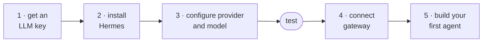

# Workshop Guide: Build Your First Daily Intelligence Agent

This is the setup path for the workshop. For full Hermes documentation, use the
official docs: <https://hermes-agent.nousresearch.com/docs>

## Success criteria

Core workshop target:

1) Hermes installed
2) One model/provider connected
3) Local CLI test works
4) Messaging Gateway connected (You can reach your agent on on Discord, Telegram, Slack, or Teams)
5) One use case bootstrapped for something you actually care about
6) Optional: Scheduled job kicking off your agent to do work for you

### Overview



## 1) LLM Inference - Get Your API Key Ready

Start by making sure you have one working LLM ready to power your agent.

### Easiest path if you do not already have a subscription: OpenRouter

OpenRouter usually has free model endpoints available:
<https://openrouter.ai/collections/free-models>.

As of *July 2026*, [Tencent: Hy3](https://openrouter.ai/tencent/hy3:free) and [NVIDIA Nemotron 3 Ultra](https://openrouter.ai/nvidia/nemotron-3-ultra-550b-a55b:free) are good, free-tier, OpenRouter models to try for this workshop.

**Free as in beer.** OpenRouter's free tier is enough for initial setup, but free requests may be used for provider training/evals. OpenRouter currently advertises limited free usage, and a single complex agent task can burn 5-20+ model requests. If you like the workflow, putting a small amount of credit on OpenRouter is the simplest hosted path.

### Subscriptions You May Already Have that Work With Hermes

Run `hermes model` and pick the provider you already have. Current Hermes docs list these common subscription/OAuth-friendly paths:

- **ChatGPT/Codex:** choose OpenAI Codex. Uses ChatGPT/Codex OAuth. Good workshop path if your account has Codex.
- **GitHub Copilot paid plans:** choose GitHub Copilot. Uses OAuth/device-code flow, `COPILOT_GITHUB_TOKEN`, `GH_TOKEN`, or `gh auth token`.
- **Google/Gemini accounts:** choose Google Gemini OAuth. Browser PKCE login; docs note free-tier support. Gemini API keys also work.
- **Grok paid plans:** choose xAI Grok OAuth.
- **Qwen accounts:** choose Qwen OAuth. Browser PKCE login.
- **MiniMax accounts:** choose MiniMax OAuth. Browser PKCE login.
- **Nous Portal subscriptions:** choose Nous Portal, or run `hermes setup --portal` for one-shot OAuth setup.


See full list here: <https://hermes-agent.nousresearch.com/docs/integrations/providers>

If none of those applies, use OpenRouter for the session. 

### Local Open Weights models (not recommended during the session)

Local models are not recommended for this session. Do not spend workshop time fighting a local model, if you have at least 24GB of VRAM or unified memory on a mac it's worth a try later.

At time of writing, [Qwen 3.6](https://unsloth.ai/docs/models/qwen3.6) is the best choice for local model running an agent that fit on common consumer hardware (20GB RAM+, perferably VRAM or mac unified memory).


## 2) Install Hermes

Follow the Official Hermes install guide: <https://hermes-agent.nousresearch.com/docs/getting-started/installation>

Default command-line install path for Linux, macOS, and WSL2:

```bash
curl -fsSL https://hermes-agent.nousresearch.com/install.sh | bash
```


### Setup Guide
1) Choose **full setup**, the Nous Portal quick setup will require a credit card
2) Model provider: **OpenRouter** if you don't have another subscription
3) Model: `tencent/hy3:free`
4) Terminal backend: local
5) Platform: skip set up gateway now - we'll do this together later in the session
6) Tools: use the default set
7) Browser provider: local

::: details Optional: Safer Terminal Backends

For the workshop, choosing the **local** terminal backend is fine. It is the
simplest path and keeps setup friction low. Just understand the tradeoff: local
means Hermes runs shell commands on the same machine and user account where you
started it.

If you want more isolation after the workshop, Hermes can run terminal commands
through other backends:

- **Docker backend:** commands run inside a container instead of directly on your
  host. This is a good next step for experimenting safely. Docker docs:
  <https://hermes-agent.nousresearch.com/docs/user-guide/docker>
- **SSH backend:** commands run on a separate machine or VM that you control.
  This is useful for homelab or production-health agents because you can keep
  Hermes away from your personal laptop. It also gives the agent a safe place to
  be root: on a disposable VM or tightly scoped server, you can let it install
  packages, restart services, inspect logs, and run commands more freely without
  giving it root on your daily machine.

SSH backend environment variables are documented here:
<https://hermes-agent.nousresearch.com/docs/reference/environment-variables#ssh-backend>

:::

## 3) Configure Provider and Model

You likely setup a model in the initial install flow, here is how you can change that.

```bash
hermes model
```

## Test Hermes works

Run a local CLI chat:

```bash
hermes --tui
```

Then write `hi, I am Bob. Who are you?` just to see if it responds.

### See What Your Agent Can Do

Check what tools and skills your agent has out of the box.

```bash
hermes tools list --platform cli

hermes skills list
```

## 4) Connect Hermes to Where You Work

Set up the gateway so Hermes can reach you on your messaging platform:

```bash
hermes gateway setup
```

Pick your platform - Discord, Telegram, Slack, Teams, or email - and follow the
wizard. Test by asking Hermes to send you a message.

Docs: <https://hermes-agent.nousresearch.com/docs/user-guide/messaging>

## 5) Choose Your Use Case

The default path is the **Daily Intelligence Agent**. If you are unsure, choose
that one. It works on any laptop, does not require production access, and matches
the main workshop promise: make Hermes read the stuff you already read every
morning, cross-reference it against your world, and bubble up what matters.

### Pick your path

Choose one use case to build next. If you are unsure, start with the default path.

<div class="path-choice-grid" aria-label="Workshop path choices">
  <a class="path-choice-card path-choice-card--default" href="/use-cases/daily-intelligence-agent">
    <span class="path-choice-badge">Default path</span>
    <strong>Daily Intelligence Agent</strong>
    <em>Morning reports over the sources you already check, ranked by what matters to you.</em>
  </a>
  <a class="path-choice-card" href="/use-cases/homelab-health">
    <span class="path-choice-badge">Technical</span>
    <strong>Homelab / Production Health</strong>
    <em>Read-only triage of disk, services, logs, containers, and backups.</em>
  </a>
  <a class="path-choice-card" href="/use-cases/alert-triage">
    <span class="path-choice-badge">On-call</span>
    <strong>Incident Triage Agent</strong>
    <em>Turn monitoring webhooks into clear human triage summaries.</em>
  </a>
  <a class="path-choice-card" href="/use-cases/chatops-data">
    <span class="path-choice-badge">Data</span>
    <strong>ChatOps Over Your Data</strong>
    <em>Ask plain-language questions over CSVs, SQLite, logs, and docs.</em>
  </a>
</div>


## References

- [Hermes docs](https://hermes-agent.nousresearch.com/docs)
- [Hermes overview on X](https://x.com/i/status/2066885278451519590)


