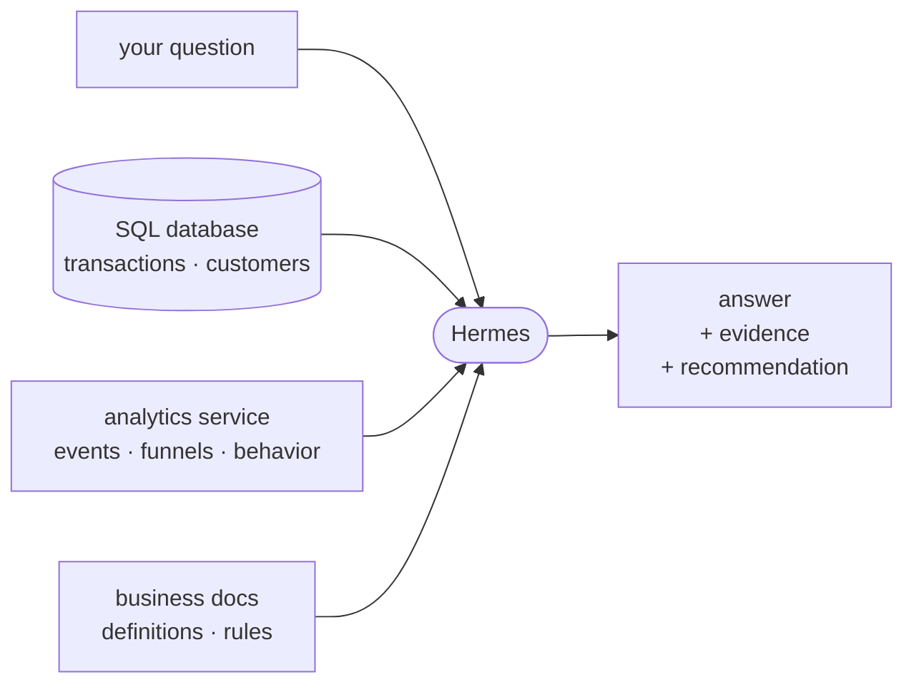

# Chat Over Your Data

Connect Hermes to the systems that already hold your data, then ask business questions in
plain language. Hermes finds the right source, runs the query, checks the result, and explains
what it means.



## The general pattern

### 1. Connect the sources

Hermes can work with data through the tools your systems expose:

- **SQL databases** for transactions, customers, subscriptions, inventory, and other
  structured records.
- **Analytics services** for events, funnels, traffic, feature usage, and user behavior.
- **APIs and MCP servers** for SaaS tools and internal services.
- **Files and documentation** for exports, schemas, metric definitions, and business rules.

The connection method can be a database client, an API, an MCP integration, or an existing
command-line tool. The important part is that Hermes can inspect the source and retrieve real
results instead of guessing.

Docs: <https://hermes-agent.nousresearch.com/docs/user-guide/features/mcp>

### 2. Define what the numbers mean

Access is only half the job. Hermes also needs the definitions your team uses:

- What counts as revenue?
- Which statuses count as active?
- How are refunds, tests, duplicates, and internal activity handled?
- Which timezone and date boundaries should a report use?

These definitions can live in a skill or in project documentation. Define them once and reuse
them across questions.

### 3. Match each question to the right source

Different systems answer different questions:

| Question | Best source |
|---|---|
| How much did we collect? | SQL transaction data |
| Where are users dropping out? | Analytics events and funnels |
| What does “active customer” mean? | Business documentation |
| Why did a metric move? | SQL + analytics + recent changes |

When sources disagree, decide which one is authoritative for that type of fact. A common
pattern is SQL for money and account state, analytics for behavior, and documentation for
definitions.

### 4. Ask the question normally

Examples:

```text
How did revenue this week compare with last week, and what drove the change?

Where is the largest drop in our signup-to-purchase funnel?

Did the new release change activation or refund behavior?

Which customer segment is growing fastest?
```

Hermes translates the question into the required queries, checks the result, and returns:

1. the answer first,
2. the comparison or trend,
3. the evidence and query,
4. the important caveat,
5. the recommended next move when one is clear.

## A useful kickoff prompt

```text
Help me build a read-only analyst over my business data.

First identify the SQL databases, analytics services, APIs, files, and business definitions
available to you. For each source, explain what questions it can answer and what it should be
treated as authoritative for.

When I ask a question:
- choose the right source or combine sources,
- inspect schemas instead of inventing fields,
- exclude test or duplicate data where appropriate,
- show the query and important filters,
- lead with the answer and explain what changed,
- say what is missing when the data cannot answer cleanly.

Start by asking me which business question matters most.
```

## Grow it after the first answer works

- **Save the definitions as a skill** so new sessions use the same metric logic.
- **Connect chat** so the team can ask from Discord, Telegram, or Slack.
- **Schedule reports** for recurring KPIs, trends, and anomaly checks.
- **Add another source** when a question cannot be answered from the current data.

## What "done" looks like

Ask one real business question. Hermes chooses the right source, returns a correct answer,
shows where it came from, and tells you what the number means. That is the pattern.
