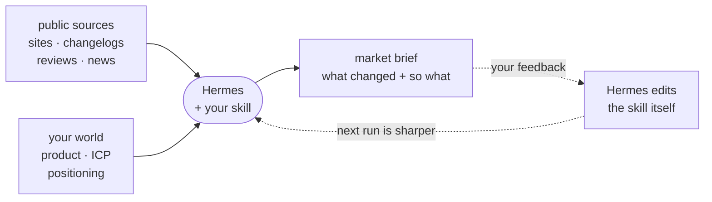

# Competitor and Market Watch

Let Hermes interview you, run your first report just pointed at competitors and market signals instead of your morning sources.

**Watches:** competitor sites, pricing pages, changelogs, blogs, app reviews, job posts, news.
**Delivers:** a short brief - what *changed*, why it might matter, links, and watch / ignore / act.
**Posture:** read public sources. No logins, no scraping behind auth, no inventing moves you cannot cite.

If you currently open five competitor tabs every Monday and still miss the thing that mattered, this is for you.



The skill remembers what each source looked like last run, so run two onward reports what *changed* - not the whole landscape again.

---

## Step 1: the kickoff prompt (paste into Hermes)

```text
Set up my Competitor and Market Watch skill.

1. Fetch this skill template with curl:
   https://raw.githubusercontent.com/chrishart0/hermes-workshop/master/examples/skills/competitor-market-watch/SKILL.md
2. Install it as a new skill named competitor-market-watch in your own skills
   directory, using your skill management tooling. Do not hardcode paths.
3. The template is not customized yet. Follow its "Bootstrap" section exactly:
   interview me briefly, then edit the skill so it is mine.
4. Keep it read-only and public-sources-only. Don't set up any delivery beyond
   what the Bootstrap section says.
```

Hermes will ask you four questions:

1. **Who you're up against** - 2-5 competitors, plus one line on what you sell and to whom.
2. **Which public sources per competitor** - pricing, changelog, blog, reviews, jobs, news.
3. **What counts as a change vs. noise.**
4. **What would make you act, and how often to run** (weekly is usually plenty).

When the bootstrap finishes, Hermes offers you a first-run message. Send it. The first brief
is a **baseline**, it maps the current state of each competitor. Change-detection kicks in
on the second run, when there's a prior snapshot to diff against.

---

## Step 2: improve it with feedback (run two)

**Feedback required:** the skill only gets sharp if you tell it what mattered. After a brief,
tell Hermes what you actually cared about and what was noise.

```text
Feedback on this brief: <e.g. 'the Northwind price change was the only useful item; drop the
funding gossip; add Contoso's job board as a source; the "act" tag was right - keep flagging
pricing that hits our Team plan; too long - keep it to five items'>

Update my competitor-market-watch skill with this feedback. Keep it read-only and
source-required. Tell me in one line what you changed.
```

Hermes edits the skill itself - competitors, sources, what counts as a change, the decision
filter, the format. Do this after the first couple of runs and it gets sharp fast.

---

## Grow it

Only after the first brief is useful:

- **Schedule it.** Weekly is usually enough. Ask Hermes to cron it for Monday morning or Friday afternoon, and verify the same way.
  Docs: <https://hermes-agent.nousresearch.com/docs/user-guide/features/cron>
- **Deliver it where you work.** Gateway to Telegram, Discord, Slack, email.
  Docs: <https://hermes-agent.nousresearch.com/docs/user-guide/messaging>
- **Tighten with feedback.** "Pricing only if it changed. Drop competitor X. Add review volume on the app store. Shorter." Hermes edits the skill, not just nods.

---

## What "done" looks like

A short competitive / market brief over *your* named competitors, reporting what changed
since last week, with links and watch / ignore / act tags - and a schedule or chat delivery
if you want it recurring.
