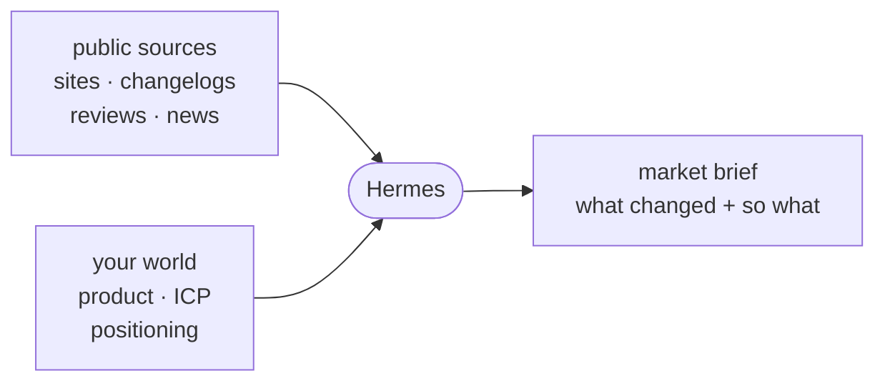

# Competitor and Market Watch

An alternative workshop path. Unlike the [default path](daily-intelligence-agent.md),
this one is a pattern you drive yourself, not a script we walk through together.

**Watches:** competitor sites, pricing pages, changelogs, blogs, app reviews, job posts, news.
**Delivers:** a short brief - what changed, why it might matter, links, and watch / ignore / act.
**Posture:** read public sources. No logins, no scraping behind auth, no inventing moves you cannot cite.

If you currently open five competitor tabs every Monday and still miss the thing that mattered, this is for you.



## Build it: the four ingredients

Write the prompt in your own words. Hermes does not need magic phrasing. A good first version has four parts:

1. **Who you are competing against.** Name 2-5 competitors or alternatives. Add one line on what you sell and who you sell it to.
2. **What counts as a change.** Pricing, packaging, launches, positioning, hiring signals, review volume, partnership news. Say what to ignore - press fluff, recycled announcements, rumor with no source.
3. **Your decision filter.** "Only surface items that could change our roadmap, pricing, sales talk track, or week plan."
4. **The output shape.** "Short brief. Each item: what changed, why it might matter to us, source link, tag: watch / ignore / act. Cap it. No filler."

### Kickoff prompt

Paste this and fill the blanks:

```text
Build me a Competitor and Market Watch skill.

My product / business:
<one or two lines>

Competitors / alternatives to watch:
1. <name + homepage or main URL>
2. <name + URL>
3. <name + URL>

Sources I care about for each (or in general):
- pricing / product pages
- changelogs or release notes
- blogs / news
- reviews if useful

What matters to me:
- <e.g. pricing changes, feature launches that hit our ICP, positioning shifts, hiring for a capability we care about>

Ignore:
- <e.g. generic AI hype, fundraising gossip, recycled press>

Rules:
- Public sources only. No logins.
- Every claim needs a source link.
- If nothing material changed, say so in one line.
- Tag each item: watch / ignore / act.
- Keep the whole brief short.

Interview me only if something is missing, then save this as a skill and run the first report.
```

Run it. Read the first brief. If it is too long, too generic, or missing a source you actually check, say so and have Hermes edit the skill.

## Grow it

Only after the first brief is useful:

- **Schedule it.** Weekly is usually enough. Ask Hermes to cron it for Monday morning or Friday afternoon. Verify with `hermes cron list`.
  Docs: <https://hermes-agent.nousresearch.com/docs/user-guide/features/cron>
- **Deliver it where you work.** Gateway to Telegram, Discord, Slack, email.
  Docs: <https://hermes-agent.nousresearch.com/docs/user-guide/messaging>
- **Tighten with feedback.** "Pricing only if it changed. Drop competitor X. Add review volume on the app store. Shorter." Hermes should edit the skill, not just nod.

## What "done" looks like

A short competitive / market brief over *your* named competitors, with links, decision tags, and a schedule or chat delivery if you want it recurring.
