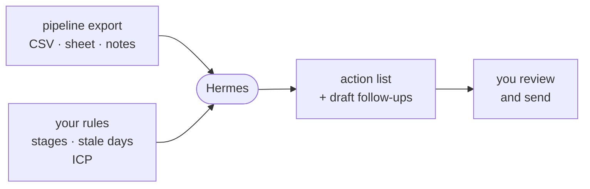

# Sales Pipeline Follow-up

An alternative workshop path. Unlike the [default path](daily-intelligence-agent.md),
this one is a pattern you drive yourself, not a script we walk through together.

**Watches:** a pipeline export - CRM CSV, spreadsheet, deal notes, last-contact dates.
**Delivers:** today's action list - stale deals, missing next steps, meeting prep, draft follow-ups.
**Posture:** read the export and draft. You send the messages. No CRM writes, no auto-email on day one.

If your pipeline lives in a sheet or a CRM you only open when you feel guilty, this is the agent that turns "I should follow up" into a short list you can actually work.



## Build it: the four ingredients

Point Hermes at one export and write a plain prompt with four parts:

1. **Name the data.** Path to the file and what the columns mean: deal name, stage, owner, amount, last contact, next step, notes.
2. **Your pipeline rules.** What "stale" means (for example: no contact in 7 days for open deals), which stages count, what is disqualified, what never gets chased.
3. **What to produce.** Ranked action list for today. For each item: why it is on the list, suggested next step, and a draft message if a follow-up is needed. Cite deal name / row so you can find it.
4. **The human-send rule.** "Draft only. Do not send email, do not update the CRM, do not invent contact history."

### Kickoff prompt

Export your open pipeline to a CSV or copy a sheet locally, then paste:

```text
Build me a Sales Pipeline Follow-up skill.

Pipeline file:
<path to CSV or sheet export>

Column meanings:
- <deal / company>
- <stage>
- <amount if any>
- <last contact date>
- <next step / notes>
- <owner / contact if present>

My rules:
- Open stages: <list>
- Stale = no contact in <N> days for open deals
- Priority: <e.g. larger deals, later stages, warm intros first>
- Never chase: <lost, disqualified, "do not contact", etc.>
- Tone for drafts: <short, direct, no hype>

Output every run:
1. Top actions for today (ranked)
2. Why each one made the list
3. Suggested next step
4. Draft follow-up message when useful
5. Deals with missing next steps
6. One-line note if the pipeline looks healthy

Rules:
- Read-only on the export
- Do not send messages
- Do not invent emails, dates, or promises not in the data
- Cite deal names / row numbers
- Keep it short enough to work in 15 minutes

If the file or columns are unclear, inspect the file and ask only what you need. Then save as a skill and run the first action list.
```

Run it on real data if you can. A 10-20 row sample is fine for the workshop. Fix the rules until the list matches what a good sales day looks like for you.

## Grow it

Only after the action list is trustworthy:

- **Schedule it.** Daily morning or every weekday before your first block. `hermes cron list` to verify.
  Docs: <https://hermes-agent.nousresearch.com/docs/user-guide/features/cron>
- **Deliver it where you work.** Gateway so the list lands in Telegram / Discord / Slack / email.
  Docs: <https://hermes-agent.nousresearch.com/docs/user-guide/messaging>
- **Meeting prep mode.** "Also prep the deals on my calendar for tomorrow from these notes."
- **Approval loop later.** Draft CRM field updates or emails for human send only after the daily list is sharp.

## What "done" looks like

Hermes reads your pipeline export and returns a ranked action list with real next steps and draft follow-ups you are willing to send after a quick edit - without writing back to the CRM on its own.
