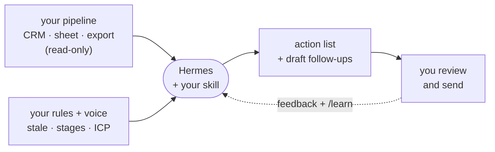

# Sales Pipeline Follow-up

An alternative workshop path, in three steps: connect your pipeline read-only, set up the
daily check-in skill, then teach it to write follow-ups in your voice.

**Watches:** your live pipeline - a CRM (HubSpot, Salesforce, Pipedrive, Attio...), a
spreadsheet, or an export. Last-contact dates, stages, next steps.
**Delivers:** today's action list - stale deals, missing next steps, meeting prep, draft follow-ups.
**Posture:** connects **read-only** and **drafts only**. You send the messages. No CRM writes, no auto-email - the credential itself is read-only, so it can't be otherwise.

If your pipeline lives in a CRM you only open when you feel guilty, this turns "I should follow up" into a short list you can actually work.



---

## Step 1: give Hermes read-only access to your pipeline

Do the credential part first, on its own. This is also the safety guarantee - the only key
Hermes ever holds for your pipeline is read-only, so it *cannot* edit your CRM or send anything.

```text
Give Hermes read-only access to my sales pipeline.

1. Ask me where my pipeline lives (a CRM like HubSpot / Salesforce / Pipedrive / Attio,
   a spreadsheet, or an export) — don't assume a CSV.
2. Walk me through creating a READ-ONLY API token for it, scoped to read deals and contacts
   only — no write, update, or delete. Look up the current steps for my specific CRM.
3. Store the token in your secret store (my profile .env or a secrets manager), never in a
   skill file or in this chat. Tell me the env var name you used.
4. Verify by pulling a few of my deals read-only and showing me a couple.

Don't set up any follow-up logic yet — just the read-only connection.
```

No CRM and just want to try it? A 10–20 row CSV or sheet export works for the workshop; point
Hermes at the file instead.

---

## Step 2: set up the daily check-in

Now install the skill and make it yours. It keeps a task list as it works, confirms the
connection from Step 1, maps your fields, and asks your rules.

```text
Set up my Sales Pipeline Follow-up skill.

1. Fetch this skill template with curl:
   https://raw.githubusercontent.com/chrishart0/hermes-workshop/master/examples/skills/sales-pipeline-followup/SKILL.md
2. Install it as a new skill named sales-pipeline-followup in your own skills
   directory, using your skill management tooling. Do not hardcode paths.
3. The template is not customized yet. Follow its "Setup" section exactly: keep a task
   list, confirm my read-only connection from Step 1, map my fields, and ask me for my
   pipeline rules, priority, and cadence.
4. Keep it read-only and draft-only — never send messages or write to my CRM.
```

Hermes asks a few short questions, then offers a first-run message. Send it, read the action
list, and check the drafts. If the ranking or the "stale" rule is off, say so - Hermes edits
the skill.

---

## Step 3: make the drafts sound like you

A generic follow-up is a tell. Teach Hermes your voice from follow-ups you've actually sent,
using `/learn`.

```text
Teach my sales-pipeline-followup skill to write in my voice.

Use /learn on these samples of follow-ups I've actually sent: <paste 3–5 real messages, or
point to a folder / mailbox of sent mail>. Learn my greeting, sign-off, sentence length,
and the words I do and don't use. Then update the skill's "Draft tone" with the concrete
patterns, draft one sample follow-up for a current deal, and show it to me.
```

Correct a draft or two. Each round it gets closer to something you'd send without editing -
that's the whole point of the loop.

---

## Grow it

Only after the action list is trustworthy:

- **Schedule it.** Daily morning or every weekday before your first block. If a gateway was
  already connected at setup, Hermes may have scheduled this for you - check `hermes cron list`
  first; otherwise ask Hermes to cron it.
  Docs: <https://hermes-agent.nousresearch.com/docs/user-guide/features/cron>
- **Deliver it where you work.** Gateway so the list lands in Telegram / Discord / Slack / email.
  Docs: <https://hermes-agent.nousresearch.com/docs/user-guide/messaging>
- **Meeting prep mode.** "Also prep the deals on my calendar for tomorrow from these notes."
- **Supervised write-back, later.** Draft a CRM note or log the follow-up you sent - for human
  approval, and only with a credential you deliberately grant for it. Not on day one.

## What "done" looks like

Hermes reads your pipeline read-only and returns a ranked action list with real next steps and
draft follow-ups - in your voice - that you're willing to send after a quick glance, without
ever writing back to the CRM on its own.
